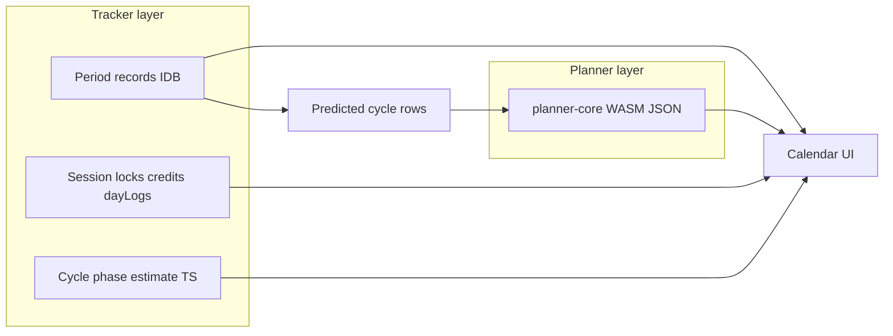

# easy-bc: UX & product plan

This document is the **living plan** for an attractive, easy-to-use client on top of the canonical Rust planner (`planner-core`). It complements the functional spec in [README.md](../README.md) and the incident contract in [incidents.md](incidents.md).

---

## 1. Intent

**easy-bc** is a **local-first personal birth control companion**: a real **calendar** for periods and life context, plus a **numeric planner** that recommends per-day actions (`U` / `W` / `C` / `A`) under a user-chosen **cumulative risk budget** over a long horizon.

- **Not** a certified medical device or FDA-cleared contraceptive.
- **Not** claiming clinical precision for fertile windows without body-signal data.
- **Is** transparent, auditable, and respectful of reproductive privacy.

---

## 2. Experience pillars

| Pillar | What it means |
|--------|----------------|
| **Calendar-first** | Users think in **real dates**, not abstract “cycle day 14” alone. The month grid is the home surface; the optimizer strip is a focused drill-down. |
| **Two layers, one story** | **Tracker layer**: bleeding, phase *estimates*, voluntary-abstinence *credits* (journal). **Planner layer**: Rust-backed recommendations when calendar-mode is on. Both must stay visually and verbally distinct so we never confuse “guess” with “optimized plan.” |
| **Trust through honesty** | Label sample cycles, wide uncertainty, and non-clinical incident deltas explicitly. No fake precision. |
| **Low friction, local-only** | IndexedDB, no account wall for core flows; optional export/delete later. |
| **Accessible** | Large touch targets on calendar cells, focus states, `aria-*` on grids and dialogs; keyboard path for month nav and day panel (to be tightened in polish passes). |

---

## 3. Information architecture (current)

| Area | Role | Primary files |
|------|------|----------------|
| **Calendar** | Month view (Monday-first), fertile shading (calendar-only math), bleeding days, planner **action + raw risk** on cells when calendar plan exists (compact/comfortable density), **.ics export** (calendar-mode mapped range), day sheet for period start/end, optimizer fields, abstinence credit toggle. | [`web/src/App.tsx`](../web/src/App.tsx), [`web/src/components/MonthCalendar.tsx`](../web/src/components/MonthCalendar.tsx), [`web/src/components/DayDetailPanel.tsx`](../web/src/components/DayDetailPanel.tsx), [`web/src/export/plannerToIcs.ts`](../web/src/export/plannerToIcs.ts), [`web/src/tracker/plannerWallMeta.ts`](../web/src/tracker/plannerWallMeta.ts) |
| **Planner** | WASM inputs, **variance summary** (logged cycle-length sample SD → SD widen → effective row SD), compute plan, horizon strip with locks / as-lived logs / replan preview, incidents, EC education. | [`web/src/App.tsx`](../web/src/App.tsx), [`web/pkg/`](../web/pkg/) (generated) |
| **History** | Table of period episodes (start, derived/set end, length). | [`web/src/App.tsx`](../web/src/App.tsx) |

**Data flow (conceptual)**

---

## 4. Interaction patterns (now vs next)

### Implemented

- **Month navigation** with prev/next; **today** ring; **legend** for bleeding / fertile / credits / sample cycle; **planner action + raw risk** on wall cells when calendar mode has a plan; **Compact / Comfortable** density (risk in title when compact).
- **Day sheet**: phase estimate, cycle-day guess, **optimizer recommendation, raw risk, override-cost line** for that wall date when applicable; **period started** / **last bleeding day**; **voluntary abstinence credit** checkbox.
- **Planner strip**: per-row cycle grid, modal for locks + as-lived logs; preview replan; **variance card** explaining cycle-length sample SD and effective ovulation SD on predicted rows.
- **iCal export (v1)**: calendar-mode only — download **.ics** with one all-day event per mapped date (`SUMMARY` includes action and risk; `DESCRIPTION` has disclaimer).
- **Persistence**: period records + legacy start migration; session (locks, realized risk, EC flag, voluntary abstinence dates, planner day logs).

### Next (UX polish — near term)

1. **Visual design pass**: cohesive palette (bleeding / fertile / planner actions), spacing scale; tabular numerics already used for risk — extend polish globally.
2. **Day sheet** as bottom sheet or slide-over on mobile width; **swipe** month change on touch.
3. **Keyboard**: shortcuts for month change, Esc to close sheet, roving tabindex on calendar grid.
4. **Empty states**: illustrated CTA when no periods (“Start by logging your period start”).
5. **Onboarding**: 3-step coach (privacy → calendar → planner) skippable.

### Next (product — medium term)

1. **Abstinence credits → planner**: define policy (e.g. soften streak penalty, widen target, or “spend” credits for explicit future flexibility) and thread into `UserOptions` or a documented side-channel; keep user-visible ledger.
2. **Single day record model**: unify `voluntaryAbstinenceDates`, as-lived `dayLogs`, and optional mood/symptom flags under one `CalendarDayEntry` schema (still local).
3. **Rolling horizon UX**: always-on “recompute” when period log changes; subtle diff highlight vs previous plan.
4. **Export / delete**: JSON export of records + session; wipe button; optional **synthetic-anchor** .ics for non-calendar horizon mode.

### Inspiration (category, not endorsement)

Draw **interaction patterns** from mature **open-source or mainstream period trackers** (onboarding, cycle summary cards, readability of fertile windows) while keeping **easy-bc’s** differentiator: **explicit cumulative risk** and **optimizer-backed** `U/W/C/A` when the user opts in. Do not copy proprietary assets or medical claims.

---

## 5. Visual semantics (recommended)

| Element | Suggestion |
|---------|------------|
| Bleeding | Warm pink/red, clear “logged” meaning. |
| Fertile estimate | Soft green/teal; copy always says “estimate.” |
| Planner `U` / `W` / `C` / `A` | Align with existing web cell colors; `W` distinct from `C`. |
| Sample cycle | Tinted/neutral stripe or corner badge “Sample.” |
| Credits | Gold/amber accent, small dot + total in header. |

---

## 6. Success metrics (non-commercial)

- User can complete **log period → enable predicted cycles → see action + risk on calendar → adjust lock → preview** without reading Rust docs.
- Screen reader announces **date + phase + planner action + raw risk** on cell focus when the plan is active.
- No silent mixing of **tracker guess** and **optimizer output** in copy.

---

## 7. Related docs

- [README.md](../README.md) — full functional requirements and algorithm context.
- [incidents.md](incidents.md) — v1 mapping for realized risk vs locks.
- [MOBILE_FFI.md](../crates/planner-core/MOBILE_FFI.md) — Android JSON parity.

---

## 8. Revision

Update this file when IA or major UX promises change; keep README “Web application” section in sync with shipped behavior.
